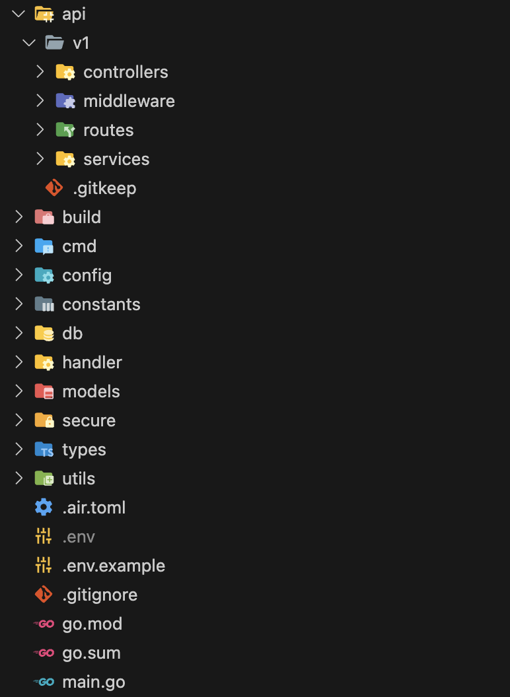

# Go REST API Boilerplate

This is a boilerplate project for building REST APIs with Go, utilizing the [GoFiber](https://github.com/gofiber/fiber) framework, [PostgreSQL](https://www.postgresql.org/docs/) for database management, and [SQLBoiler](https://github.com/volatiletech/sqlboiler) for ORM.

## Folder Structure

- `/api/v1`

  - `/routes` - Contains all API route definitions.
  - `/controllers` - Handles request validation and delegates to services.
  - `/services` - Implements business logic, database interactions, and other services.
  - `/middlewares` - Includes middleware for authentication, logging, rate limiting, etc.
  - `/types` - Defines custom types used across the application.

- `/build` - Contains the built binary; this directory is ignored by Git.
- `/cmd` - Initializes the Fiber application and sets up basic middleware configuration.
- `/config` - Manages configuration and environment variables.
- `/db` - Manages database connections and related utilities.
- `/handlers` - Manages response formatting and database transactions.
- `/models` - Auto-generated models from database tables using SQLBoiler.
- `/secure` - Stores SSL certificates; this directory is ignored by Git.
- `/utils` - Contains utility functions and helpers.

- `main.go` - The entry point of the application.

### Pro-tip

- Enhance your development experience by using the Material Icon Theme in VSCode for a more visually appealing folder structure.



## How to use

1. The repo contains product API implementation for reference.

2. Clone the repo and rename the folder to your project name.

3. Search for `honestyan/go-fiber-boilerplate` in the project and replace it with `<your-github-id/project-name>`.

4. Run `go install github.com/volatiletech/sqlboiler/v4/drivers/sqlboiler-psql@latest` to install sqlboiler for generating models.

5. Change the `models/sqlboiler.toml` file to match your database configuration.

6. Under models folder, run `sqlboiler psql` to generate models from database tables, this will create a `models` folder.

7. Copy the contents of `models/models` folder to `models` folder in the root of the project.

8. Run `go mod tidy` to install all the dependencies.

9. Copy `.env.example` to `.env` and change the values as per your configuration.

10. Run `go build -o ./build/main && ./build/main` to build and run the app.

## Optional

1. Run `go get github.com/cosmtrek/air` to install air for hot reloading.

2. Run `air` to start the app with hot reloading.

## Notes

- `Success` Handler for successful requests.

- `BuildError` Handler for build errors.

- Start new PGX trx from `controllers` only to ensure proper transaction handling.

- `/api/v1` is the base path for all routes except `/` for health check.

- `/models` consider keeping this in a separate repository and importing it as a Git submodule for better modularity.

- To set up the sample product and user API implementation, create the `products` and `users` table with the following SQL script:

```sql
DO $$
BEGIN
   IF NOT EXISTS (SELECT 1 FROM pg_type WHERE typname = 'gender_enum') THEN
      CREATE TYPE gender_enum AS ENUM ('male', 'female');
   END IF;
END $$;

CREATE TABLE IF NOT EXISTS users (
  id SERIAL PRIMARY KEY,
  username varchar(50) NOT NULL,
  password varchar(255) NOT NULL,
  email varchar(50) NOT NULL,
  name varchar(50) NOT NULL,
  gender gender_enum NOT NULL DEFAULT 'male',
  created timestamp NOT NULL,
  modified timestamp NOT NULL DEFAULT CURRENT_TIMESTAMP
);

CREATE TABLE IF NOT EXISTS products (
  id SERIAL PRIMARY KEY,
  name varchar(255) NOT NULL,
  description text NOT NULL,
  price int NOT NULL,
  created timestamp NOT NULL,
  modified timestamp NOT NULL DEFAULT CURRENT_TIMESTAMP
);
```
